# 图 Graph

::: tip
[链接](https://www.cnblogs.com/jaxu/p/11338294.html)
:::

在计算机科学中，图是一种网络结构的抽象模型，它是一组由边连接的顶点组成。一个图 `G = (V, E)` 由以下元素组成：

- V：一组顶点
- E：一组边，连接 V 中的顶点

下图表示了一个图的结构：

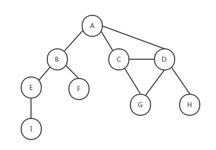

在介绍如何用 JavaScript 实现图之前，我们先介绍一些和图相关的术语。

如上图所示，由一条边连接在一起的顶点称为**相邻顶点**，A 和 B 是相邻顶点，A 和 D 是相邻顶点，A 和 C 是相邻顶点......A 和 E 是不相邻顶点。一个顶点的**度**是其相邻顶点的数量，A 和其它三个顶点相连，所以 A 的度为 3，E 和其它两个顶点相连，所以 E 的度为 2......**路径**是一组相邻顶点的连续序列，如上图中包含路径 ABEI、路径 ACDG、路径 ABE、路径 ACDH 等。**简单路径**要求路径中不包含有重复的顶点，如果将**环**的最后一个顶点去掉，它也是一个简单路径。例如路径 ADCA 是一个环，它不是一个简单路径，如果将路径中的最后一个顶点 A 去掉，那么它就是一个简单路径。如果图中不存在环，则称该图是**无环的**。如果图中任何两个顶点间都存在路径，则该图是**连通的**，如上图就是一个连通图。如果图的边没有方向，则该图是**无向图**，上图所示为无向图，反之则称为**有向图**，下图所示为有向图：

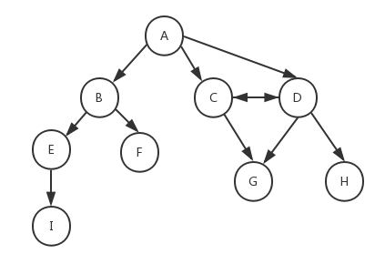

在有向图中，如果两个顶点间在双向上都存在路径，则称这两个顶点是**强连通**的，如上图中 C 和 D 是强连通的，而 A 和 B 是非强连通的。如果有向图中的任何两个顶点间在双向上都存在路径，则该有向图是**强连通的**，非强连通的图也称为**稀疏图**。
此外，图还可以是**加权的**。前面我们看到的图都是**未加权的**，下图为一个加权的图：

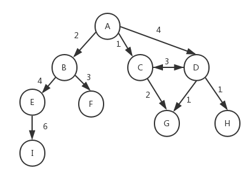

可以想象一下，前面我们介绍的[树](../tree)和[链表](../link-list)也属于图的一种特殊形式。图在计算机科学中的应用十分广泛，例如我们可以搜索图中的一个特定顶点或一条特定的边，或者寻找两个顶点间的路径以及最短路径，检测图中是否存在环等等。
存在多种不同的方式来实现图的数据结构，下面介绍几种常用的方式。

## 邻接矩阵

在邻接矩阵中，我们用一个二维数组来表示图中顶点之间的连接，如果两个顶点之间存在连接，则这两个顶点对应的二维数组下标的元素的值为 1，否则为 0。下图是用邻接矩阵方式表示的图：

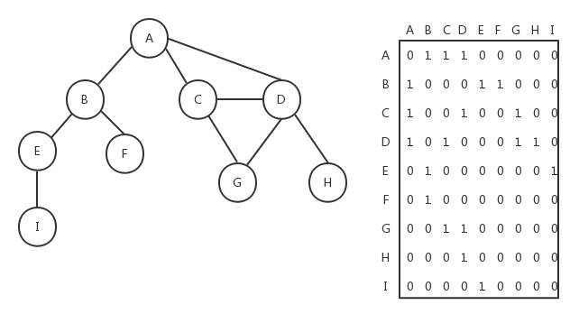

如果是加权的图，我们可以将邻接矩阵中二维数组里的值 1 改成对应的加权数。邻接矩阵方式存在一个缺点，如果图是非强连通的，则二维数组中会有很多的 0，这表示我们使用了很多的存储空间来表示根本不存在的边。另一个缺点就是当图的顶点发生改变时，对于二维数组的修改会变得不太灵活。

## 邻接表

图的另外一种实现方式是邻接表，它是对邻接矩阵的一种改进。邻接表由图中每个顶点的相邻顶点列表所组成。如下图所示，我们可以用数组、链表、字典或散列表来表示邻接表。

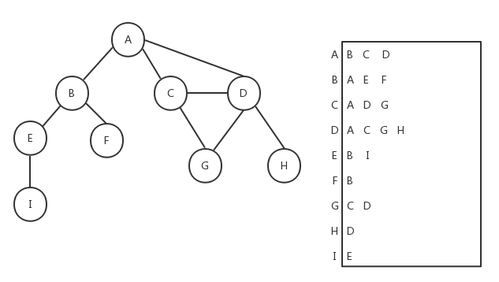

## 关联矩阵

我们还可以用关联矩阵来表示图。在关联矩阵中，矩阵的行表示顶点，列表示边。关联矩阵通常用于边的数量比顶点多的情况下，以节省存储空间。如下图所示为关联矩阵方式表示的图：

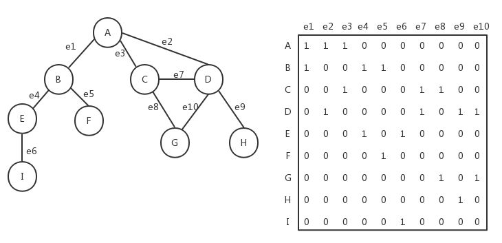

下面我们重点看下如何用邻接表的方式表示图。我们的 Graph 类的骨架如下，它用邻接表方式来实现无向图：

```js
class Graph {
    constructor() {
        this.vertices = [] // 用来存放图中的顶点
        this.adjList = new Dictionary() // 用来存放图中的边
    }

    // 向图中添加一个新顶点
    addVertex(v) {}

    // 向图中添加a和b两个顶点之间的边
    addEdge(a, b) {}
}
```

在 Graph 类中，我们用数组 vertices 来保存图中的所有顶点，用字典（请参考[《字典》](../dict)一文中的 Dictionary 类）adjList 来保存图中每一个顶点到相邻顶点的关系列表，在字典中，顶点被作为键值。请参考前面我们给出的邻接表的示意图。然后在 Graph 类中，我们提供两个方法，方法 addVertex() 用来向图中添加一个新顶点，方法 addEdge()用来向图中添加给定的顶点 a 和顶点 b 之间的边。让我们来看下这两个方法的实现。

```js
addVertex (v) {
    if (!this.vertices.includes(v)) {
        this.vertices.push(v);
        this.adjList.set(v, []);
    }
}
```

要添加一个新顶点，首先要判断该顶点在图中是否已经存在了，如果已经存在则不能添加。如果不存在，就在 vertices 数组中添加一个新元素，然后在字典 adjList 中添加一个以该顶点作为 key 的新元素，值为空数组。

```js
addEdge (a, b) {
    // 如果图中没有顶点a，先添加顶点a
    if (!this.adjList.has(a)) {
        this.addVertex(a);
    }
    // 如果图中没有顶点b，先添加顶点b
    if (!this.adjList.has(b)) {
        this.addVertex(b);
    }

    this.adjList.get(a).push(b); // 在顶点a中添加指向顶点b的边
    this.adjList.get(b).push(a); // 在顶点b中添加指向顶点a的边
}
```

addEdge() 方法也很简单，首先要确保给定的两个顶点 a 和 b 在图中必须存在，如果不存在，则调用 addVertex() 方法进行添加，然后分别在字典中找到键值为顶点 a 和键值为顶点 b 的元素，在对应的值中添加一个新元素。

下面是 Graph 类的完整代码，其中的 toString()方法是为了我们测试用的，它的存在不是必须的。

```js
class Graph {
    constructor() {
        this.vertices = [] // 用来存放图中的顶点
        this.adjList = new Dictionary() // 用来存放图中的边
    }

    // 向图中添加一个新顶点
    addVertex(v) {
        if (!this.vertices.includes(v)) {
            this.vertices.push(v)
            this.adjList.set(v, [])
        }
    }

    // 向图中添加a和b两个顶点之间的边
    addEdge(a, b) {
        // 如果图中没有顶点a，先添加顶点a
        if (!this.adjList.has(a)) {
            this.addVertex(a)
        }
        // 如果图中没有顶点b，先添加顶点b
        if (!this.adjList.has(b)) {
            this.addVertex(b)
        }

        this.adjList.get(a).push(b) // 在顶点a中添加指向顶点b的边
        this.adjList.get(b).push(a) // 在顶点b中添加指向顶点a的边
    }

    // 获取图的vertices
    getVertices() {
        return this.vertices
    }

    // 获取图中的adjList
    getAdjList() {
        return this.adjList
    }

    toString() {
        let s = ""
        this.vertices.forEach(v => {
            s += `${v} -> `
            this.adjList.get(v).forEach(n => {
                s += `${n} `
            })
            s += "\n"
        })
        return s
    }
}
```

对于本文一开始给出的图，我们添加下面的测试用例：

```js
let graph = new Graph()
let myVertices = ["A", "B", "C", "D", "E", "F", "G", "H", "I"]
myVertices.forEach(v => {
    graph.addVertex(v)
})
graph.addEdge("A", "B")
graph.addEdge("A", "C")
graph.addEdge("A", "D")
graph.addEdge("C", "D")
graph.addEdge("C", "G")
graph.addEdge("D", "G")
graph.addEdge("D", "H")
graph.addEdge("B", "E")
graph.addEdge("B", "F")
graph.addEdge("E", "I")

console.log(graph.toString())
```

下面是测试结果：

```shell
A -> B C D
B -> A E F
C -> A D G
D -> A C G H
E -> B I
F -> B
G -> C D
H -> D
I -> E
```

可以看到，与示意图是相符合的。

和[树](../tree)类似，我们也可以对图进行遍历，以访问图中的所有顶点。图的遍历方式分为两种：**广度优先**（Breadth-First Search，BFS）和**深度优先**（Depth-First Search，DFS）。对图的遍历可以用来寻找特定的顶点或两个顶点之间的最短路径，以及检查图是否连通、图中是否含有环等。

| **算法** | **数据结构** | **描述** |
| --- | --- | --- |
| 深度优先 | 栈 | 将图的顶点存入栈中（有关栈的介绍可以参考[《栈》](../stack) |
| ），顶点是沿着路径被探索的，存在新的相邻顶点就去访问。 |  |  |
| 广度优先 | 队列 | 将图的顶点存入队列中（有关队列的介绍可以参考[《队列》](../queue) |
| ），最先入队列的顶点先被探索。 |  |  |

在接下来要实现的算法中，我们按照如下的约定对图中的顶点进行遍历，每个顶点最多访问两次：

- 白色：表示该顶点未被访问。
- 灰色：表示该顶点被访问过，但未被探索。
- 黑色：表示该顶点被访问并且被探索过。

### 广度优先

广度优先算法会从指定的第一个顶点开始遍历图，先访问这个顶点的所有相邻顶点，然后再访问这些相邻顶点的相邻顶点，以此类推。最终，广度优先算法会先广后深地访问图中的所有顶点。下面是广度优先遍历的示意图：

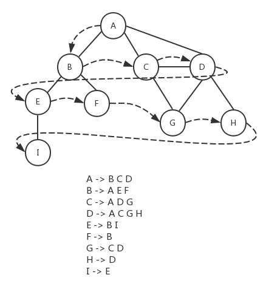

由于我们采用邻接表的方式来存储图的数据，对于图的每个顶点，都有一个字典与之对应，字典的键值为顶点的值，字典的内容为与该顶点相邻的顶点列表。基于这种数据结构，我们可以考虑将所有顶点的邻接顶点存入队列，然后依次处理队列中的顶点。下面是具体的遍历步骤：

1. 将开始顶点存入队列。
2. 遍历开始顶点的所有邻接顶点，如果这些邻接顶点没有被访问过（颜色为白色），则将它们标记为被访问（颜色为灰色），然后加入队列。
3. 将开始顶点标记为被处理（颜色为黑色）。
4. 循环处理队列中的顶点，直到队列为空。

下面是该算法的具体实现：

```js
let Colors = {
    WHITE: 0,
    GREY: 1,
    BLACK: 2
}

let initializeColor = vertices => {
    let color = {}
    vertices.forEach(v => (color[v] = Colors.WHITE))
    return color
}

let breadthFirstSearch = (graph, startVertex, callback) => {
    let vertices = graph.getVertices()
    let adjList = graph.getAdjList()
    let color = initializeColor(vertices)
    let queue = new Queue()

    queue.enqueue(startVertex)

    while (!queue.isEmpty()) {
        let u = queue.dequeue()
        adjList.get(u).forEach(n => {
            if (color[n] === Colors.WHITE) {
                color[n] = Colors.GREY
                queue.enqueue(n)
            }
        })

        color[u] = Colors.BLACK
        if (callback) callback(u)
    }
}
```

breadthFirstSearch() 方法接收一个 graph 对象，图的数据通过该对象传入。参数 startVertex 指定了遍历的起始顶点。回调函数 callback 规定了要如何处理被遍历到的顶点。

首先通过 initializeColor() 函数将所有的顶点标记为未被访问过（颜色为白色），这些颜色保存在以顶点值为 key 的 color 对象中。图的 vertices 和 adjList 属性可以通过 getVertices() 和 getAdjList() 方法得到，然后构造一个队列 queue（有关队列类 Queue 请参考[《队列》](../queue)），按照上面描述的步骤对图的顶点进行遍历。

在前面我们给出的测试用例的基础上，添加下面的代码，来看看 breadthFirstSearch()方法的执行结果：

```js
breadthFirstSearch(graph, "A", value => console.log(`visited vertex: ${value}`))
```

参数 graph 为前面测试用例中 Graph 类的实例，也就是我们用来保存图的数据的对象，'A' 被作为遍历的起始顶点，在回调函数中，打印一行文本，用来展示顶点被遍历的顺序。下面是测试结果：

```shell
visited vertex: A
visited vertex: B
visited vertex: C
visited vertex: D
visited vertex: E
visited vertex: F
visited vertex: G
visited vertex: H
visited vertex: I
```

尝试将'I'作为起始顶点，看看执行结果：

```shell
visited vertex: I
visited vertex: E
visited vertex: B
visited vertex: A
visited vertex: F
visited vertex: C
visited vertex: D
visited vertex: G
visited vertex: H
```

为了方便理解，我们将顶点 I 放到最上面。从顶点 I 开始，首先遍历到的是它的相邻顶点 E，然后是 E 的相邻顶点 B，其次是 B 的相邻顶点 A 和 F，A 的相邻顶点 C 和 D，C 的相邻顶点 G（D 已经被遍历过了），最后是 D 的相邻顶点 H（C 和 G 已经被遍历过了）。

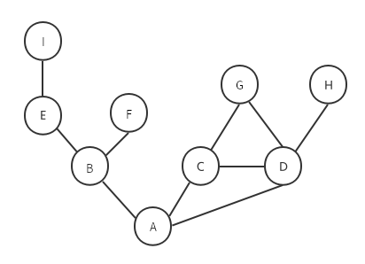

#### 寻找最短路径

前面展示了广度优先算法的工作原理，我们可以使用它做更多的事情，例如在一个图 G 中，从顶点 v 开始到其它所有顶点间的最短距离。我们考虑一下如何用 BFS 来实现寻找最短路径。
假设两个相邻顶点间的距离为 1，从顶点 v 开始，在其路径上每经过一个顶点，距离加 1。下面是对 breadthFirstSearch() 方法的改进，用来返回从起始顶点开始到其它所有顶点间的距离，以及所有顶点的前置顶点。

```js
let BFS = (graph, startVertex) => {
    let vertices = graph.getVertices()
    let adjList = graph.getAdjList()
    let color = initializeColor(vertices)
    let queue = new Queue()
    let distances = {}
    let predecessors = {}

    queue.enqueue(startVertex)

    // 初始化所有顶点的距离为0，前置节点为null
    vertices.forEach(v => {
        distances[v] = 0
        predecessors[v] = null
    })

    while (!queue.isEmpty()) {
        let u = queue.dequeue()
        adjList.get(u).forEach(n => {
            if (color[n] === Colors.WHITE) {
                color[n] = Colors.GREY
                distances[n] = distances[u] + 1
                predecessors[n] = u
                queue.enqueue(n)
            }
        })

        color[u] = Colors.BLACK
    }

    return { distances, predecessors }
}
```

在 BFS() 方法中，我们定义了两个对象 distances 和 predecessors，用来保存从起始顶点出发到其它所有顶点的距离以及这些顶点的前置顶点。BFS() 方法不需要 callback 回调函数，因为它会自行输出最终结果。与 breadthFirstSearch() 方法的逻辑类似，只不过在开始的时候将所有顶点的距离初始化为 0，前置顶点初始化为 null，然后在遍历的过程中，重新设置顶点的 distances 值和 predecessors 值。我们仍然将顶点 A 作为起始顶点，来看看测试结果：

```js
console.log(BFS(graph, "A"))
```

```js
{
  distances: { A: 0, B: 1, C: 1, D: 1, E: 2, F: 2, G: 2, H: 2, I: 3 },
  predecessors: {
    A: null,
    B: 'A',
    C: 'A',
    D: 'A',
    E: 'B',
    F: 'B',
    G: 'C',
    H: 'D',
    I: 'E'
  }
}
```

如你所见，distances 为从顶点 A 开始到其它所有顶点的最短距离（相邻顶点间的距离为 1），predecessors 记录了所有顶点的前置顶点。以 BFS()方法的返回结果为基础，通过下面的代码，我们可以得出从顶点 A 开始到其它所有顶点的最短路径：

```js
let shortestPathA = BFS(graph, "A")
let startVertex = "A"
myVertices.forEach(v => {
    let path = new Stack()
    for (let v2 = v; v2 !== startVertex; v2 = shortestPathA.predecessors[v2]) {
        path.push(v2)
    }

    path.push(startVertex)
    let s = path.pop()
    while (!path.isEmpty()) {
        s += ` - ${path.pop()}`
    }

    console.log(s)
})
```

其中的 Stack 类可以参考[《栈》](../stack)。下面是对应的执行结果：

```shell
A
A - B
A - C
A - D
A - B - E
A - B - F
A - C - G
A - D - H
A - B - E - I
```

以上我们说的都是未加权的图，对于加权的图，广度优先算法并不是最合适的。下面给出了另外几种最短路径算法：

**Dijkstra** - 寻找从指定顶点到其它所有顶点的最短路径的贪心算法。

```js
const INF = Number.MAX_SAFE_INTEGER
const minDistance = (dist, visited) => {
    let min = INF
    let minIndex = -1
    for (let v = 0; v < dist.length; v++) {
        if (visited[v] === false && dist[v] <= min) {
            min = dist[v]
            minIndex = v
        }
    }
    return minIndex
}
const dijkstra = (graph, src) => {
    const dist = []
    const visited = []
    const { length } = graph
    for (let i = 0; i < length; i++) {
        dist[i] = INF
        visited[i] = false
    }
    dist[src] = 0
    for (let i = 0; i < length - 1; i++) {
        const u = minDistance(dist, visited)
        visited[u] = true
        for (let v = 0; v < length; v++) {
            if (!visited[v] && graph[u][v] !== 0 && dist[u] !== INF && dist[u] + graph[u][v] < dist[v]) {
                dist[v] = dist[u] + graph[u][v]
            }
        }
    }
    return dist
}
```

**Floyd-Warshall** - 计算图中所有最短路径的动态规划算法。

```js
const floydWarshall = graph => {
    const dist = []
    const { length } = graph
    for (let i = 0; i < length; i++) {
        dist[i] = []
        for (let j = 0; j < length; j++) {
            if (i === j) {
                dist[i][j] = 0
            } else if (!isFinite(graph[i][j])) {
                dist[i][j] = Infinity
            } else {
                dist[i][j] = graph[i][j]
            }
        }
    }
    for (let k = 0; k < length; k++) {
        for (let i = 0; i < length; i++) {
            for (let j = 0; j < length; j++) {
                if (dist[i][k] + dist[k][j] < dist[i][j]) {
                    dist[i][j] = dist[i][k] + dist[k][j]
                }
            }
        }
    }
    return dist
}
```

**Kruskal** - 求解加权无向连通图的最小生成树（MST）的贪心算法。

```js
const INF = Number.MAX_SAFE_INTEGER
const find = (i, parent) => {
    while (parent[i]) {
        i = parent[i] // eslint-disable-line prefer-destructuring
    }
    return i
}
const union = (i, j, parent) => {
    if (i !== j) {
        parent[j] = i
        return true
    }
    return false
}
const initializeCost = graph => {
    const cost = []
    const { length } = graph
    for (let i = 0; i < length; i++) {
        cost[i] = []
        for (let j = 0; j < length; j++) {
            if (graph[i][j] === 0) {
                cost[i][j] = INF
            } else {
                cost[i][j] = graph[i][j]
            }
        }
    }
    return cost
}
const kruskal = graph => {
    const { length } = graph
    const parent = []
    let ne = 0
    let a
    let b
    let u
    let v
    const cost = initializeCost(graph)
    while (ne < length - 1) {
        for (let i = 0, min = INF; i < length; i++) {
            for (let j = 0; j < length; j++) {
                if (cost[i][j] < min) {
                    min = cost[i][j]
                    a = u = i
                    b = v = j
                }
            }
        }
        u = find(u, parent)
        v = find(v, parent)
        if (union(u, v, parent)) {
            ne++
        }
        cost[a][b] = cost[b][a] = INF
    }
    return parent
}
```

**Prime** - 求解加权无向连通图的最小生成树（MST）的贪心算法。

```js
const INF = Number.MAX_SAFE_INTEGER
const minKey = (graph, key, visited) => {
    // Initialize min value
    let min = INF
    let minIndex = 0
    for (let v = 0; v < graph.length; v++) {
        if (visited[v] === false && key[v] < min) {
            min = key[v]
            minIndex = v
        }
    }
    return minIndex
}
const prim = graph => {
    const parent = []
    const key = []
    const visited = []
    const { length } = graph
    for (let i = 0; i < length; i++) {
        key[i] = INF
        visited[i] = false
    }
    key[0] = 0
    parent[0] = -1
    for (let i = 0; i < length - 1; i++) {
        const u = minKey(graph, key, visited)
        visited[u] = true
        for (let v = 0; v < length; v++) {
            if (graph[u][v] && !visited[v] && graph[u][v] < key[v]) {
                parent[v] = u
                key[v] = graph[u][v]
            }
        }
    }
    return parent
}
```

### 深度优先

深度优先算法从图的第一个顶点开始，沿着这个顶点的一条路径递归查找到最后一个顶点，然后返回并探查路径上的其它路径，直到所有路径都被访问到。最终，深度优先算法会先深后广地访问图中的所有顶点。下面是深度优先遍历的示意图：

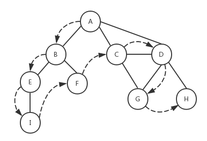

我们仍然采用和广度优先算法一样的思路，一开始将所有的顶点初始化为白色，然后沿着路径递归探查其余顶点，当顶点被访问过，将颜色改为灰色，如果顶点被探索过（处理过），则将颜色改为黑色。下面是深度优先算法的具体实现：

```js
let depthFirstSearchVisit = (u, color, adjList, callback) => {
    color[u] = Colors.GREY
    if (callback) callback(u)

    adjList.get(u).forEach(n => {
        if (color[n] === Colors.WHITE) {
            depthFirstSearchVisit(n, color, adjList, callback)
        }
    })

    color[u] = Colors.BLACK
}

let depthFirstSearch = (graph, callback) => {
    let vertices = graph.getVertices()
    let adjList = graph.getAdjList()
    let color = initializeColor(vertices)

    vertices.forEach(v => {
        if (color[v] === Colors.WHITE) {
            depthFirstSearchVisit(v, color, adjList, callback)
        }
    })
}
```

具体执行步骤为：

1. 将图中所有顶点的颜色初始化为白色。
2. 遍历顶点，此时 A 作为第一个顶点，它的颜色为白色，于是调用函数 depthFirstSearchVisit()，并将顶点 A、color、graph.adjList 作为参数传入。
3. 在 depthFirstSearchVisit() 函数内部，由于顶点 A 被访问过了，所以将颜色设置为灰色，并执行 callback 回调函数（如果存在），然后遍历 A 的邻接顶点 B、C、D。
4. B 未被访问过，颜色为白色，所以将 B 作为参数递归调用 depthFirstSearchVisit() 函数。B 设置为灰色，callback('B')。遍历 B 的邻接节点 E 和 F。
5. E 未被访问过，颜色为白色，所以将 E 作为参数递归调用 depthFirstSearchVisit() 函数。E 设置为灰色，callback('E')。遍历 E 的邻接节点 I。
6. I 未被访问过，颜色为白色，所以将 I 作为参数递归调用 depthFirstSearchVisit() 函数。I 设置为灰色，callback('I')。I 没有邻接节点，然后将 I 设置为黑色。递归返回到 5。
7. E 没有其它邻接节点，将 E 设置为黑色。递归返回到 4。
8. 遍历 B 的另一个邻接节点 F，F 未被访问过，颜色为白色，所以将 F 作为参数递归调用 depthFirstSearchVisit() 函数。F 设置为灰色，callback('F')。F 没有邻接节点，然后将 F 设置为黑色。递归返回到 4。
9. B 的所有邻接节点都被访问过了，将 B 设置为黑色。递归返回到 3。
10. 访问 A 的第二个邻接节点 C，C 未被访问过，颜色为白色，所以将 C 作为参数递归调用 depthFirstSearchVisit()函数。C 设置为灰色，callback('C')。遍历 C 的邻接节点 D、G。
11. D 未被访问过，颜色为白色，所以将 D 作为参数递归调用 depthFirstSearchVisit() 函数。D 设置为灰色，callback('D')。遍历 D 的邻接节点 G 和 H。
12. G 未被访问过，颜色为白色，所以将 G 作为参数递归调用 depthFirstSearchVisit() 函数。G 设置为灰色，callback('G')。G 没有邻接节点，然后将 G 设置为黑色。递归返回到 11。
13. 遍历 D 的另一个邻接节点 H，H 未被访问过，颜色为白色，所以将 H 作为参数递归调用 depthFirstSearchVisit() 函数。H 设置为灰色，callback('H')。H 没有邻接节点，然后将 H 设置为黑色。递归返回到 11。
14. D 的所有邻接节点都被访问过了，将 D 设置为黑色。递归返回到 10。
15. 遍历 C 的另一个邻接节点 G，由于 G 已经被访问过，对 C 的邻接节点的遍历结束。将 C 设置为黑色。递归返回到 3。
16. 访问 A 的最后一个邻接节点 D，由于 D 已经被访问过，对 A 的邻接节点的遍历结束。将 A 设置为黑色。
17. 然后对剩余的节点进行遍历。由于剩余的节点都被设置为黑色了，所以程序结束。

对应的测试用例及执行结果如下：

```js
depthFirstSearch(graph, value => console.log(`visited vertex: ${value}`))
```

```shell
visited vertex: A
visited vertex: B
visited vertex: E
visited vertex: I
visited vertex: F
visited vertex: C
visited vertex: D
visited vertex: G
visited vertex: H
```

为了便于理解，我们将整个遍历过程用下面的示意图来展示：

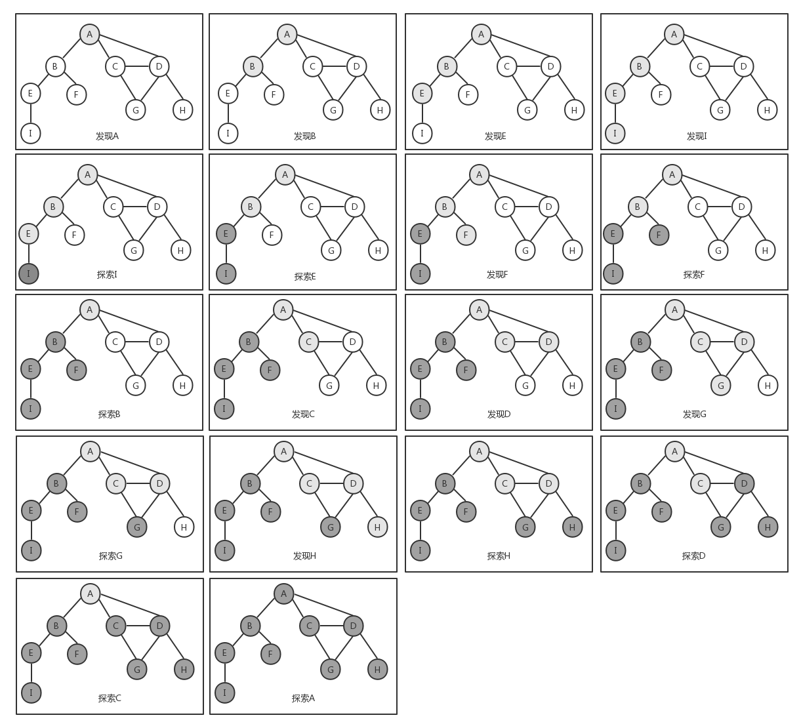

前面说过，深度优先算法的数据结构是栈，然而这里我们并没有使用栈来存储任何数据，而是使用了函数的递归调用，其实递归也是栈的一种表现形式。另外一点，如果图是连通的（即图中任何两个顶点之间都存在路径），我们可以对上述代码中的 depthFirstSearch() 方法进行改进，只需要对图的起始顶点开始遍历一次就可以了，而不需要遍历图的所有顶点，因为从起始顶点开始的递归就可以覆盖图的所有顶点。

#### 拓扑排序

前面展示了深度优先算法的工作原理，我们可以使用它做更多的事情，例如拓扑排序（toplogical sorting，也叫做 topsort 或者 toposort）。与广度优先算法类似，我们也对上面的 depthFirstSeach() 方法进行改进，以说明如何使用深度优先算法来实现拓扑排序：

```js
let DFSVisit = (u, color, discovery, finished, predecessors, time, adjList) => {
    color[u] = Colors.GREY
    discovery[u] = ++time.count

    adjList.get(u).forEach(n => {
        if (color[n] === Colors.WHITE) {
            predecessors[n] = u
            DFSVisit(n, color, discovery, finished, predecessors, time, adjList)
        }
    })

    color[u] = Colors.BLACK
    finished[u] = ++time.count
}

let DFS = graph => {
    let vertices = graph.getVertices()
    let adjList = graph.getAdjList()
    let color = initializeColor(vertices)
    let discovery = {}
    let finished = {}
    let predecessors = {}
    let time = { count: 0 }

    vertices.forEach(v => {
        finished[v] = 0
        discovery[v] = 0
        predecessors[v] = null
    })

    vertices.forEach(v => {
        if (color[v] === Colors.WHITE) {
            DFSVisit(v, color, discovery, finished, predecessors, time, adjList)
        }
    })

    return { discovery, finished, predecessors }
}
```

DFS() 方法会输出图中每个顶点的发现时间和探索时间，我们假定时间从 0 开始，每经过一步时间值加 1。在 DFS() 方法中，我们用变量 discovery，finished，predecessors 来保存每个顶点的发现时间、探索时间和前置顶点（这个和广度优先算法中寻找最短路径中的一致，但最终执行结果会有区别），最终的输出结果中也会反映这三个值。这里需要注意的是，变量 time 之所以被定义为对象而不是一个普通的数字，是因为我们需要在函数间传递这个变量，如果只是作为值传递，函数内部对变量的修改不会影响到它的原始值，但是我们就是需要在函数递归调用的过程中不断记录 time 的变化过程，所以采用值传递的方式显然不行。因此我们将 time 定义为一个对象，对象被作为引用传递给函数，这样在函数内部对它的修改就会反映到原始值上。

来看看对 DFS() 方法的测试结果：

```js
console.log(DFS(graph))
```

```js
{
  discovery: { A: 1, B: 2, C: 10, D: 11, E: 3, F: 7, G: 12, H: 14, I: 4 },
  finished: { A: 18, B: 9, C: 17, D: 16, E: 6, F: 8, G: 13, H: 15, I: 5 },
  predecessors: {
    A: null,
    B: 'A',
    C: 'A',
    D: 'C',
    E: 'B',
    F: 'B',
    G: 'D',
    H: 'D',
    I: 'E'
  }
}
```

我们将结果反映到示意图上，这样更加直观：

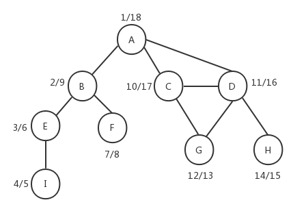

示意图上每一个顶点左边的数字是顶点的发现时间，右边的数字是顶点的探索时间，全部完成时间是 18，可以结合前面的深度优先算法遍历过程示意图来看，它们是对应的。同时我们也看到，深度优先算法的 predecessors 和广度优先算法的 predecessors 会有所不同。
拓扑排序只能应用于**有向无环图**（DAG）。基于上面 DFS() 方法的返回结果，我们可以对顶点的完成时间（探索时间 finished）进行排序，以得到我们需要的拓扑排序结果。
如果要实现有向图，只需要对前面我们实现的 Graph 类的 addEdge() 方法略加修改，将最后一行删掉。当然，我们也可以在 Graph 类的构造函数中指明是有向图还是无向图，下面是改进后的 Graph 类：

```js
class Graph {
    constructor(isDirected = false) {
        this.isDirected = isDirected
        this.vertices = [] // 用来存放图中的顶点
        this.adjList = new Dictionary() // 用来存放图中的边
    }

    // 向图中添加一个新顶点
    addVertex(v) {
        if (!this.vertices.includes(v)) {
            this.vertices.push(v)
            this.adjList.set(v, [])
        }
    }

    // 向图中添加a和b两个顶点之间的边
    addEdge(a, b) {
        // 如果图中没有顶点a，先添加顶点a
        if (!this.adjList.has(a)) {
            this.addVertex(a)
        }
        // 如果图中没有顶点b，先添加顶点b
        if (!this.adjList.has(b)) {
            this.addVertex(b)
        }

        this.adjList.get(a).push(b) // 在顶点a中添加指向顶点b的边
        if (this.isDirected !== true) {
            this.adjList.get(b).push(a) // 如果为无向图，则在顶点b中添加指向顶点a的边
        }
    }

    // 获取图的vertices
    getVertices() {
        return this.vertices
    }

    // 获取图中的adjList
    getAdjList() {
        return this.adjList
    }

    toString() {
        let s = ""
        this.vertices.forEach(v => {
            s += `${v} -> `
            this.adjList.get(v).forEach(n => {
                s += `${n} `
            })
            s += "\n"
        })
        return s
    }
}
```

然后我们对有向图应用 DFS 算法：

```js
let graph = new Graph()
let myVertices = ["A", "B", "C", "D", "E", "F"]
myVertices.forEach(v => {
    graph.addVertex(v)
})
graph.addEdge("A", "C")
graph.addEdge("A", "D")
graph.addEdge("B", "D")
graph.addEdge("B", "E")
graph.addEdge("C", "F")
graph.addEdge("F", "E")
console.log(DFS(graph))
```

下面是返回结果：

```js
{
  discovery: { A: 1, B: 11, C: 2, D: 8, E: 4, F: 3 },
  finished: { A: 10, B: 12, C: 7, D: 9, E: 5, F: 6 },
  predecessors: { A: null, B: null, C: 'A', D: 'A', E: 'F', F: 'C' }
}
```

示意图如下：

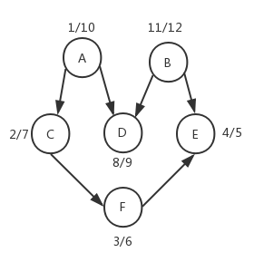

对顶点的完成时间进行倒序排序，得到的拓扑排序结果为：B - A - D - C - F - E。
