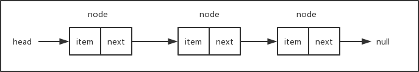
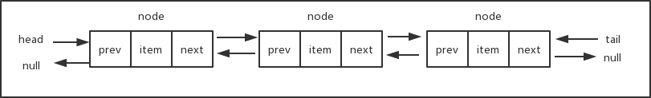
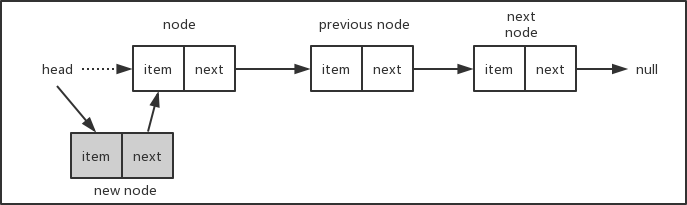
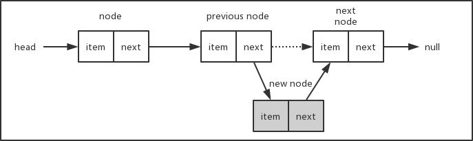
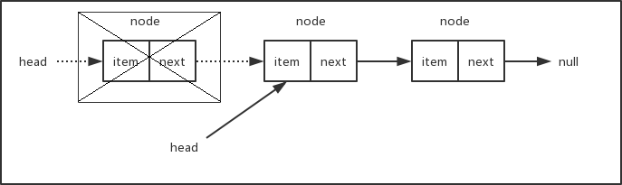
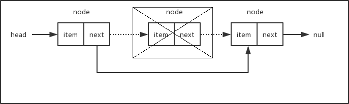
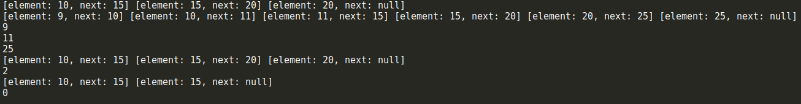
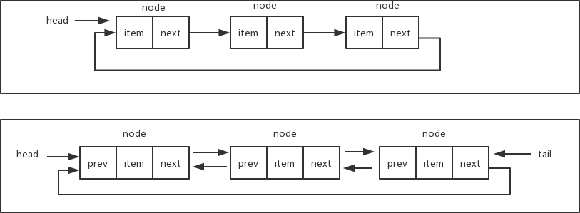
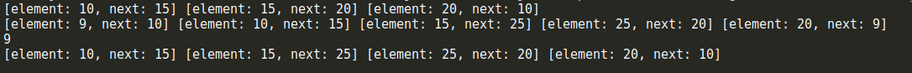

# 链表 LinkList

链表用来存储有序的元素集合，与数组不同，链表中的元素并非保存在连续的存储空间内，每个元素由一个存储元素本身的节点和一个指向下一个元素的指针构成。当要移动或删除元素时，只需要修改相应元素上的指针就可以了。对链表元素的操作要比对数组元素的操作效率更高。下面是链表数据结构的示意图



上面链表中每一个元素只有一个 `next` 指针，用来指向下一个节点，这样的链表称之为单向链表，我们只能从链表的头部开始遍历整个链表，任何一个节点只能找到它的下一个节点，而不能找到它的上一个节点。双向链表中的每一个元素拥有两个指针，一个用来指向下一个节点，一个用来指向上一个节点。在双向链表中，除了可以像单向链表一样从头部开始遍历之外，还可以从尾部进行遍历。下面是双向链表的数据结构示意图：



## 单向链表

### 说明

要实现链表数据结构，关键在于保存 `head` 元素（即链表的头元素）以及每一个元素的 `next` 指针，有这两部分我们就可以很方便地遍历链表从而操作所有的元素。可以把链表想象成一条锁链，锁链中的每一个节点都是相互连接的，我们只要找到锁链的头，整条锁链就都可以找到了。让我们来看一下具体的实现方式。

### 步骤

首先我们需要一个辅助类，用来描述链表中的节点。这个类很简单，只需要两个属性，一个用来保存节点的值，一个用来保存指向下一个节点的指针。

```js
function ListNode(element) {
  this.element = element;
  this.next = null;
}
```

下面是链表类的基本骨架

```js
class LinkList {
  constructor() {
    this.length = 0;
    this.head = null;
  }
  // 向链表中添加节点
  append(element) {
    var node = new ListNode(element);
    if (this.head === null) {
      this.head = node;
    } else {
      var current = this.getElementAt(this.length - 1);
      current.next = node;
    }
    this.length++;
  }
  // 在链表的指定位置插入节点
  insert(position, element) {
    if (position < 0 || position > this.length - 1) {
      return false;
    }
    var node = new ListNode(element);
    if (position === 0) {
      node.next = this.head;
      this.head = node;
    } else {
      var previous = this.getElementAt(position - 1);
      node.next = previous.next;
      previous.next = node;
    }
    this.length++;
    return true;
  }
  // 删除链表中指定位置的元素，并返回这个元素的值
  removeAt(position) {
    if (position < 0 || position > this.length - 1) {
      return null;
    }
    var current = this.head;
    if (position === 0) {
      this.head = current.next;
    } else {
      var previous = this.getElementAt(position - 1);
      current = previous.next;
      previous.next = current.next;
    }
    this.length--;
    return current.element;
  }
  // 删除链表中对应的元素
  remove(element) {
    var index = this.indexOf(element);
    return this.removeAt(index);
  }
  // 在链表中查找给定元素的索引
  indexOf(element) {
    var current = this.head;
    for (var i = 0; i < this.length; i++) {
      if (current.element === element) {
        return i;
      }
      current = current.next;
    }
    return -1;
  }
  // 返回链表中索引所对应的元素
  getElementAt(position) {
    if (position < 0 || position > this.length - 1) {
      return null;
    }
    var current = this.head;
    for (var i = 0; i < position; i++) {
      current = current.next;
    }
    return current;
  }
  // 判断链表是否为空
  isEmpty() {
    // return this.head === null;
    return this.length === 0;
  }
  // 返回链表的长度
  size() {
    return this.length;
  }
  // 返回头节点
  getHead() {
    return this.head;
  }
  // 清空链表
  clear() {
    this.head = null;
    this.length = 0;
  }
  // 辅助方法，按指定格式输出链表中的所有元素，方便测试验证结果
  toString() {
    var current = this.head;
    var s = '';

    while (current) {
      var next = current.next;
      next = next ? next.element : 'null';
      s += `[element: ${current.element}, next: ${next}] `;
      current = current.next;
    }

    return s;
  }
}
```

让我们从查找链表元素的方法 `getElementAt()` 开始，因为后面我们会多次用到它。

```js
getElementAt(position) {
  if (position < 0 || position > this.length - 1) {
    return null;
  }
  var current = this.head;
  for (var i = 0; i < position; i++) {
    current = current.next;
  }
  return current;
}
```

首先判断参数 `position` 的边界值，如果值超出了索引的范围（小于 `0` 或者大于`length - 1`），则返回 `null`。我们从链表的 `head` 开始，遍历整个链表直到找到对应索引位置的节点，然后返回这个节点。是不是很简单？和所有有序数据集合一样，链表的索引默认从 `0` 开始，只要找到了链表的头（所以我们必须在 `LinkList` 类中保存 `head` 值），然后就可以遍历找到索引所在位置的元素。

有了 `getElementAt()` 方法，接下来我们就可以很方便地实现 `append()` 方法，用来在链表的尾部添加新节点。

```js
append(element) {
  var node = new ListNode(element);
  // 如果当前链表为空，则将 head 指向 node
  if (this.head === null) {
    this.head = node;
  } else {
    // 否则，找到链表尾部的元素，然后添加新元素
    var current = this.getElementAt(this.length - 1);
    current.next = node;
  }
  this.length++;
}
```

如果链表的 `head` 为 `null`（这种情况表示链表为空），则直接将 `head` 指向新添加的元素。否则，通过 `getElementAt()` 方法找到链表的最后一个节点，将该节点的 `next` 指针指向新添加的元素。新添加的元素的 `next` 指针默认为 `null`，链表最后一个元素的 `next` 值为 `null`。将节点挂到链表上之后，不要忘记将链表的长度加 `1`，我们需要通过`length` 属性来记录链表的长度。

接下来我们要实现 `insert()` 方法，可以在链表的任意位置添加节点。

```js
insert(position, element) {
  // position 不能超过边界值
  if (position < 0 || position > this.length - 1) {
    return false;
  }

  var node = new ListNode(element);

  if (position === 0) {
    node.next = this.head;
    this.head = node;
  } else {
    var previous = this.getElementAt(position - 1);
    node.next = previous.next;
    previous.next = node;    
  }
  this.length++;
  return true;
}
```

首先也是要判断参数 `position` 的边界值，不能越界。当 `position` 的值为 `0` 时，表示要在链表的头部插入新节点，对应的操作如下图所示。将新插入节点的 `next` 指针指向现在的 `head`，然后更新 `head` 的值为新插入的节点。



如果要插入的节点在链表的中间或者尾部，对应的操作如下图。假设链表长度为 `3`，要在位置 `2` 插入新节点，我们首先找到位置 `2` 的前一个节点 `previous node`，将新节点 `new node` 的 `next` 指针指向 `previous node` 的 `next` 所对应的节点，然后再将`previous node` 的 `next` 指针指向 `new node`，这样就把新节点挂到链表中了。考虑一下，当插入的节点在链表的尾部，这种情况也是适用的。而如果链表为空，即链表的 `head` 为 `null`，则参数 `position` 会超出边界条件，从而 `insert()` 方法会直接返回 `false`。



最后，别忘了更新 `length` 属性的值，将链表的长度加 `1`。

按照相同的方式，我们可以很容易地写出 `removeAt()` 方法，用来删除链表中指定位置的节点。

```js
removeAt(position) {
  // position 不能超出边界值
  if (position < 0 || position > this.length - 1) {
    return null;
  }
  var current = this.head;
  if (position === 0) {
    this.head = current.next;
  } else {
    var previous = this.getElementAt(position - 1);
    current = previous.next;
    previous.next = current.next;
  }
  this.length--;
  return current.element;
}
```

下面两张示意图说明了从链表头部和其它位置删除节点的情况。





如果要删除的节点为链表的头部，只需要将 `head` 移到下一个节点即可。如果当前链表只有一个节点，那么下一个节点为 `null`，此时将 `head` 指向下一个节点等同于将 `head` 设置成 `null`，删除之后链表为空。如果要删除的节点在链表的中间部分，我们需要找出 `position` 所在位置的前一个节点，将它的 `next` 指针指向 `position` 所在位置的下一个节点。总之，删除节点只需要修改相应节点的指针，使断开位置左右相邻的节点重新连接上。被删除的节点由于再也没有其它部分的引用而被丢弃在内存中，等待垃圾回收器来清除。

最后，别忘了将链表的长度减 `1`。

下面我们来看看 `indexOf()` 方法，该方法返回给定元素在链表中的索引位置。

```js
indexOf(element) {
  var current = this.head;

  for (var i = 0; i < this.length; i++) {
    if (current.element === element) {
      return i;
    }
    current = current.next;
  }

  return -1;
}
```

我们从链表的头部开始遍历，直到找到和给定元素相同的元素，然后返回对应的索引号。如果没有找到对应的元素，则返回 `-1`。

在 `isEmpty()` 方法中，我们可以根据 `length` 是否为 `0` 来判断链表是否为空，当然也可以根据 `head` 是否为 `null` 来进行判断，前提是所有涉及到链表节点添加和移除的方法都要正确地更新 `length` 和 `head`。`toString()` 方法只是为了方便测试而编写的，我们来看看几个测试用例：

```js
var linkList = new LinkList();
linkList.append(10);
linkList.append(15);
linkList.append(20);
console.log(linkList.toString());

linkList.insert(0, 9);
linkList.insert(2, 11);
linkList.insert(5, 25);
console.log(linkList.toString());

console.log(linkList.removeAt(0));
console.log(linkList.removeAt(1));
console.log(linkList.removeAt(3));
console.log(linkList.toString());

console.log(linkList.indexOf(20));

linkList.remove(20);

console.log(linkList.toString());

linkList.clear();
console.log(linkList.size());
```



## 双向链表

### 步骤

由于双向链表具有单向链表的所有特性，因此我们的双向链表类可以继承自前面的单向链表类，不过辅助类 `Node` 需要添加一个 `prev` 属性，用来指向前一个节点。

```js
function Node(element) {
  this.element = element;
  this.next = null;
  this.prev = null;
}
```

下面是继承自 `LinkList` 类的双向链表类的基本骨架

```js
class DoubleLinkList extends LinkList {
  constructor() {
    super();
    this.tail = null; // 尾节点
  }
}
```

先来看看 `append()` 方法的实现。当链表为空时，除了要将 `head` 指向当前添加的节点外，还要将 `tail` 也指向当前要添加的节点。当链表不为空时，直接将 `tail` 的 `next` 指向当前要添加的节点 `node`，然后修改 `node` 的 `prev` 指向旧的 `tail`，最后修改 `tail` 为新添加的节点。我们不需要从头开始遍历整个链表，而通过 `tail` 可以直接找到链表的尾部，这一点比单向链表的操作要更方便。最后将 `length` 的值加 `1`，修改链表的长度。

```js
append(element) {
  var node = new Node(element);

  // 如果链表为空，则将 head 和 tail 都指向当前添加的节点
  if (this.head === null) {
    this.head = node;
    this.tail = node;
  } else {
    // 否则，将当前节点添加到链表的尾部
    this.tail.next = node;
    node.prev = this.tail;
    this.tail = node;
  }
  this.length++;
}
```

由于双向链表可以从链表的尾部往前遍历，所以我们修改了 `getElementAt()` 方法，对基类中单向链表的方法进行了改写。当要查找的元素的索引号大于链表长度的一半时，从链表的尾部开始遍历。

```js
getELementAt(position) {
  if (position < 0 || position > this.length - 1) return null;
  // 从后向前遍历
  if (position > Math.floor(this.length / 2)) {
    var current = this.tail;
    for (var i = this.length - 1; i > position; i--) {
      current = current.prev;
    }
    return current;
  } else {
    return super.getELementAt(position);
  }
}
```

有两种遍历方式，从前往后遍历调用的是基类单向链表里的方法，从后往前遍历需要用到节点的 `prev` 指针，用来查找前一个节点。

我们同时还需要修改 `insert()` 和 `removeAt()` 这两个方法。记住，与单向链表唯一的区别就是要同时维护 `head` 和 `tail`，以及每一个节点上的 `next` 和 `prev` 指针。

```js
insert(position, element) {
  if (position < 0 || position > this.length - 1) return false;

  // 插入到尾部
  if (position === this.length) {
    this.append(element);
  } else {
    var node = new ListNode(element);
    // 插入到头部
    if (position === 0) {
      if (this.head === null) {
        this.head = node;
        this.tail = node;
      } else {
        node.next = this.head;
        this.head.prev = node;
        this.head = node;
      }
    } else {
      // 插入到中间位置
      var current = this.getElementAt(position);
      var previous = current.prev;
      node.next = current;
      node.prev = previous;
      previous.next = node;
      current.prev = node;
    }
  }
  this.length++;
  return true;
}

removeAt(position) {
  if (position < 0 || position > this.length - 1) return null;

  var current = this.head;
  var previous;

  // 移除头部元素
  if (position === 0) {
    this.head = current.next;
    this.head.prev = null;
    if (this.length === 1) {
      this.tail = null;
    }
  } else if (position === this.length - 1) {
    // 移除尾部元素
    current = this.tail;
    this.tail = current.prev;
    this.tail.next = null;
  } else {
    // 移除中间元素
    current = this.getELementAt(position);
    previous = current.prev;
    previous.next = current.next;
    current.next.prev = previous;
  }
  this.length--;
  return current.element;
}
```

操作过程中需要判断一些特殊情况，例如链表的头和尾，以及当前链表是否为空等等，否则程序可能会在某些特殊情况下导致越界和报错。下面是一个完整的双向链表类的代码

```js
class DoubleLinkList extends LinkList {
  constructor() {
    super();
    this.tail = null;
  }
  append(element) {
    var node = new ListNode(element);
    if (this.head === null) {
      this.head = node;
      this.tail = node;
    } else {
      this.tail.next = node;
      node.prev = this.tail;
      this.tail = node;
    }
    this.length++;
  }
  getElementAt(position) {
    if (position < 0 || position > this.length - 1) return null;
    if (position > Math.floor(this.length / 2)) {
      var current = this.tail;
      for (var i = this.length - 1; i > position; i--) {
        current = current.prev;
      }
      return current;
    } else {
      super.getElementAt(position);
    }
  }
  insert(position, element) {
    if (position < 0 || position > this.length - 1) return false;

    if (position === this.length) {
      this.append(element);
    } else {
      var node = new ListNode(element);
      if (position === 0) {
        if (this.head === null) {
          this.head = node;
          this.tail = node;
        } else {
          node.next = this.head;
          this.head.prev = node;
          this.head = node;
        }
      } else {
        var current = this.getElementAt(position);
        var previous = current.prev;
        node.next = current;
        node.prev = previous;
        previous.next = node;
        current.prev = node;
      }
    }
    this.length++;
    return true;
  }
  removeAt(position) {
    if (position < 0 || position > this.length - 1) return null;
    var current = this.head;
    var previous;
    if (position === 0) {
      this.head = current.next;
      this.head.prev = null;
      if (this.length === 1) {
        this.tail = null; 
      }
    } else if (position === this.length - 1) {
      current = this.tail;
      this.tail = current.prev;
      this.tail.next = null;
    } else {
      current = this.getElementAt(position);
      previous = current.prev;
      previous.next = current.next;
      current.next.prev = previous;
    }
    this.length--;
    return current.element;
  }
  getTail() {
    return this.tail;
  }
  clear() {
    super.clear();
    this.tail = null;
  }
  toString() {
    var current = this.head;
    var s = '';

    while (current) {
      var next = current.next;
      var previous = current.prev;
      next = next ? next.element : 'null';
      previous = previous ? previous.element : 'null';
      s += `[element: ${current.element}, prev: ${previous}, next: ${next}]`;
      current = current.next;
    }

    return s;
  }
}
```

我们重写了 `toString()` 方法以方便更加清楚地查看测试结果。下面是一些测试用例：

```js
let doubleLinkList = new DoubleLinkList();
doubleLinkList.append(10);
doubleLinkList.append(15);
doubleLinkList.append(20);
doubleLinkList.append(25);
doubleLinkList.append(30);
console.log(doubleLinkList.toString());
console.log(doubleLinkList.getElementAt(1).element);
console.log(doubleLinkList.getElementAt(2).element);
console.log(doubleLinkList.getElementAt(3).element);

doubleLinkList.insert(0, 9);
doubleLinkList.insert(4, 24);
doubleLinkList.insert(7, 35);
console.log(doubleLinkList.toString());

console.log(doubleLinkList.removeAt(0));
console.log(doubleLinkList.removeAt(1));
console.log(doubleLinkList.removeAt(5));
console.log(doubleLinkList.toString());
```

对应的结果如下

```shell
[element: 10, prev: null, next: 15] [element: 15, prev: 10, next: 20] [element: 20, prev: 15, next: 25] [element: 25, prev: 20, next: 30] [element: 30, prev: 25, next: null]
20
[element: 9, prev: null, next: 10] [element: 10, prev: 9, next: 15] [element: 15, prev: 10, next: 20] [element: 20, prev: 15, next: 24] [element: 24, prev: 20, next: 25] [element: 25, prev: 24, next: 30] [element: 30, prev: 25, next: 35] [element: 35, prev: 30, next: null]
15
[element: 10, prev: null, next: 20] [element: 20, prev: 10, next: 24] [element: 24, prev: 20, next: 25] [element: 25, prev: 24, next: 35] [element: 35, prev: 25, next: null]
```

## 循环链表

### 介绍

顾名思义，循环链表的尾部指向它自己的头部。循环链表可以有单向循环链表，也可以有双向循环链表。下面是单向循环链表和双向循环链表的数据结构示意图



在实现循环链表时，需要确保最后一个元素的 `next` 指针指向 `head`。下面是单向循环链表的完整代码

```js
class CircularLinkList extends LinkList {
  constructor() {
    super();
  }
  append(element) {
    let node = new ListNode(element);
    if (this.head === null) this.head = node;
    else {
      let current = this.getElementAt(this.length - 1);
      current.next = node;
    }
    // 将新添加的元素的 next 指向 head
    node.next = this.head;
    this.length++;
  }
  insert(element, position) {
    if (position < 0 || position > this.length - 1) return false;
    let node = new ListNode(element);
    if (position === 0) {
      node.next = this.head;
      let current = this.getElementAt(this.length - 1);
      current.next = node;
      this.head = node;
    } else {
      var previous = this.getElementAt(position - 1);
      node.next = previous.next;
      previous.next = node;
    }
    this.length++;
    return true;
  }
  removeAt(position) {
    if (position < 0 || position > this.length - 1) return null;
    let current = this.head;
    if (position === 0) this.head = current.next;
    else {
      let previous = this.getElementAt(position - 1);
      current = previous.next;
      previous.next = current.next;
    }
    this.length--;
    if (this.length > 1) {
      let last = this.getElementAt(this.length - 1);
      last.next = this.head;
    }
    return current.element;
  }
  toString() {
    let current = this.head;
    let s = '';
    for (let i = 0; i < this.length; i++) {
      let next = current.next;
      next = next ? next.element : 'null';
      s += `[element: ${current.element}, next: ${next}]`;
      current = current.next;
    }
  }
}
```

单向循环链表的测试用例

```js
let circularLinkList = new CircularLinkList();
circularLinkList.append(10);
circularLinkList.append(15);
circularLinkList.append(20);

console.log(circularLinkList.toString());

circularLinkList.insert(0, 9);
circularLinkList.insert(3, 25);
console.log(circularLinkList.toString());

console.log(circularLinkList.removeAt(0));
console.log(circularLinkList.toString());
```

对应的结果如下


