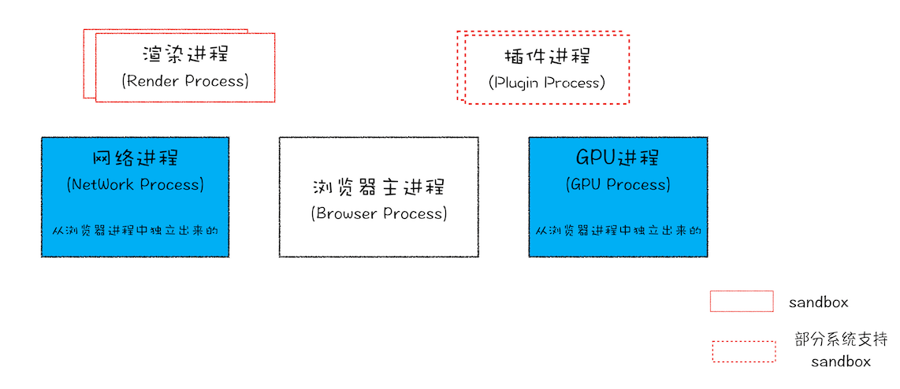

# 进程和线程

进程（process）和线程（thread）是操作系统的基本概念

## 进程

进程是 CPU 资源分配的最小单位（是能拥有资源和独立运行的最小单位）

::: info

- 一个进程就是一个程序的运行实例，启动一个程序时，操作系统会为该程序创建一块内存，用来存放代码、运行中的数据和一个执行任务的主线程，我们把这样的一个运行环境叫进程
- 任何程序运行都需要有它自己专属的内存空间，可以把这块内存空间简单理解为进程。每个应用至少有一个进程，进程之间相互独立，即使要通信，也需要双方同意
:::

## 线程

线程是 CPU 调度的最小单位（是建立在进程基础上的一次程序运行单位）

::: info

- 线程是进程内的一个执行单元，线程是不能单独存在的，是依附于进程并由进程来启动和管理的
- 在拥有进程后，就可以运行程序代码，而运行代码的 "人" 称之为线程。一个进程至少有一个线程，所以在进程开启后会自动创建一个线程来运行代码，该线程也被称为主线程。如果程序需要同时执行多块代码，主线程就会启动更多的线程来执行代码，所以一个进程中可以包含多个线程
:::

## 进程和线程的关系特点

1. 进程是拥有资源的基本单位；线程是调度和分配的基本单位（是进程内的一个执行单元，也是进程那的可调度实体）
2. 进程之间相互隔离，互不干扰
3. 同一进程的所有线程共享该进程的所有数据
4. 一个进程关闭后，操作系统会回收进程占用的内存
5. 进程是计算机管理运行程序的一种方式，一个进程下可包含一个或者多个线程，线程可以理解为子进程
6. 一个进程可以并发执行多个线程
7. 进程中任意一线程执行出错，都会导致整个进程崩溃
8. 一个线程只能属于一个进程，而一个进程可以包含多个线程（但至少有一个主线程）
9. 线程无地址空间，它包括在进程的地址空间里
10. 线程的开销和代价比进程小

## 僵尸进程和孤儿进程

- 孤儿进程

父进程退出了，而它的一个或多个进程还在运行，这些子进程都会成为孤儿进程。孤儿进程将被初始进程所收养，并由初始进程对它们完成状态进行收集工作

- 僵尸进程

子进程比父进程优先结束，而父进程又没有释放子进程占用的资源，那么子进程的进程描述符仍旧保存在系统中，这种进程称为僵尸进程

## Chrome 打开一个页面会有几个进程？

- **浏览器主进程**

负责界面显示、用户交互、子进程管理，同时提供存储等功能

- **渲染进程**

负责将 HTML CSS 和 JavaScript 转换为用户可以与之交互的网页

::: info

- 排版引擎 Blink 和 JavaScript 引擎 V8 都是运行在该进程中
- 默认情况下 Chrome 会为每个 Tab 标签创建一个渲染进程
- 出于安全考虑渲染进程都是运行在沙箱模式下
:::

- **GPU 进程**

负责网页、Chrome 的 UI 界面的绘制

- **网络进程**

负责页面的网络资源加载（之前是作为一个模块运行在浏览器进程）

- **插件进程**

负责插件的运行（因为插件易崩溃所以需要通过插件进程来隔离，以保证插件崩溃不会对浏览器和页面造成影响）

## 浏览器的进程和线程

// TODO

---

## 浏览器有哪些进程和线程

浏览器是一个多进程多线程的应用程序，其内部工作极其复杂，为了避免各工作间相互影响，同时减少连环崩溃的几率，当启动浏览器后，它将会自动启动多个进程。（另外，可以在浏览器的任务管理器中查看当前的所有进程）

最主要的进程如下：

1. **浏览器进程**：主要负责界面显示、用户交互、子进程管理等。浏览器进程内部会启动多个线程处理不同的任务
2. **网络进程**：负责加载网络资源。网络进程内部会启动多个线程来处理不同的网络任务
3. **渲染进程**：渲染进程启动后，会开启一个渲染主线程，它负责执行 html、css、js 代码

默认情况下，浏览器会为每个标签页开启一个新的渲染进程，以保证不同的标签页之间不相互影响（未来可能会限制同一个域下共用一个渲染进程，具体需要参考 chrome 官网文档）

## 浏览器渲染主线程是如何工作的

渲染主线程是浏览器中最繁忙的线程，需要它处理的任务包括但不限于

- 解析 html
- 解析 css
- 计算样式
- 布局
- 处理图层
- 每秒把页面画 60 次
- 执行全局 js 代码
- 执行时间处理函数
- 执行计时器的回调函数
- ......

## 为什么 js 是单线程

因为多个线程同时操作 dom，会发生冲突，出现意料之外的情况。所以说，单线程是异步产生的原因

## 渲染主线程的排队机制（事件循环 or 消息循环）

1. 最开始时，渲染主线程会进入一个无限循环
2. 每一次循环会检查消息队列中是否有任务存在。如果有，就取出第一个任务来执行，执行完当前任务后，进入下一次循环；如果没有任务等待被执行，则进入休眠状态
3. 其他所有线程（包括其他进程的线程）可以随时向消息队列中添加任务。新任务会被添加到消息队列的末尾。在添加新任务时，如果主线程是休眠状态，则会将其唤醒以继续通过循环来拿取任务
