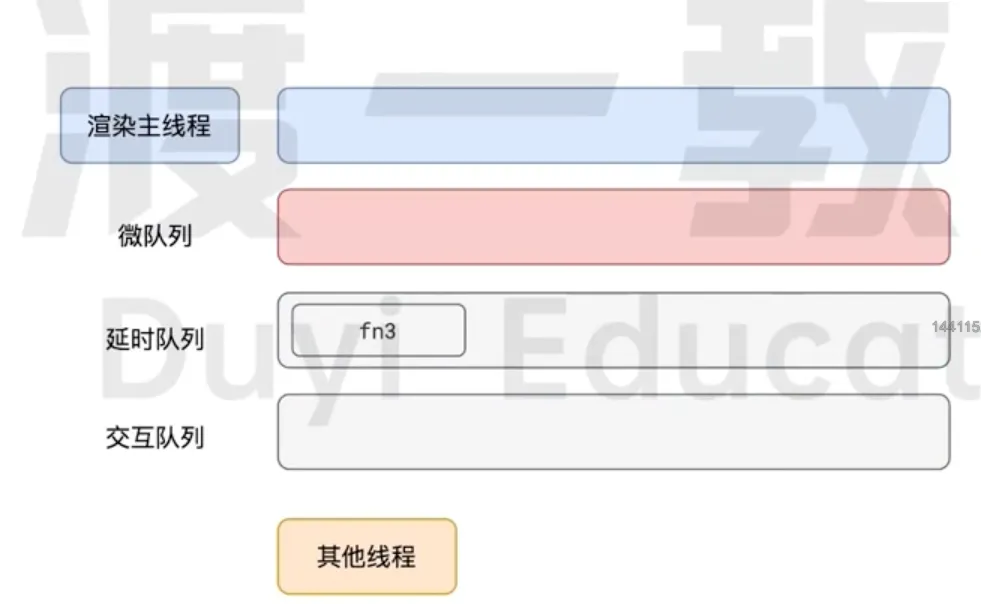
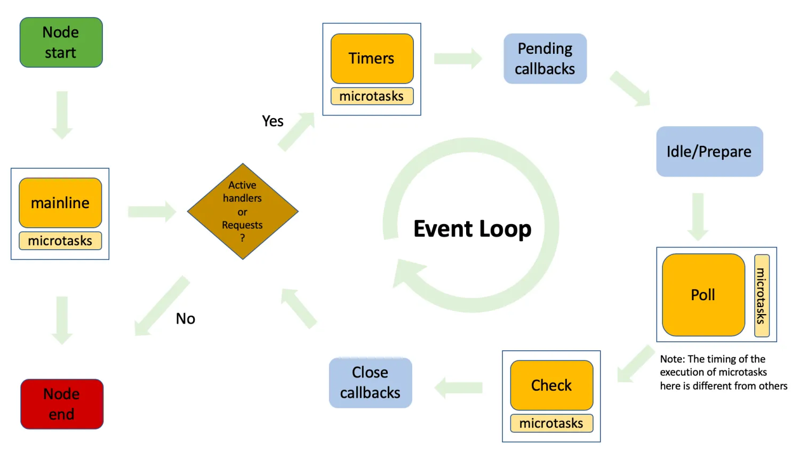

# 事件循环

## 浏览器事件循环

### event loop / message loop

- 事件循环又叫做消息循环（chrome 里叫 message loop），是**浏览器渲染主线程的工作方式（也是异步的实现方式）**
- 在 chrome 的源码中，它会开启一个不会结束的 for 循环，每次循环从消息队列中取出第一个任务执行，而其他线程只需要在合适的时机将任务加入到队列末尾即可
- 过去把消息队列简单分为宏任务队列和微任务队列，这种说法目前已无法满足复杂的浏览器环境，取而代之的是一种更加灵活多变的处理方式
- 根据 w3c 官方的解释，每个任务有不同的类型，同类型的任务必须在同一个队列，不同的任务可以属于不同的队列。不同任务队列有不同的优先级，在一次事件循环中，由浏览器自行决定取哪一个队列的任务。但浏览器必须拥有一个微任务队列，微任务队列的任务一定具有最高的优先级，从而优先调度执行

::: danger 旧 - 浏览器事件循环机制 event loop

- js 是单线程执行的，在代码执行的过程中，通过将不同函数的**执行上下文**压入**执行栈**中来保证代码的有序执行
- 最开始将整个 **script 脚本作为一个宏任务**执行，执行过程中同步代码直接执行
- 执行同步代码时，如果遇到了异步事件，js 引擎将不会一直等待其返回结果，而是将这个事件暂时挂起，继续执行**执行栈**中的其它任务
- 在异步事件执行完毕后，判断任务类型，将其回调函数插入分别插入到**宏任务队列**或**微任务队列**，**宏任务队列和微任务队列都属于消息队列**
- 当执行栈中的任务执行完毕后，js 引擎会首先判断微任务队列中是否有任务可以执行，如果有就将微任务队列队首的事件压入**执行栈**中等待执行，直到微任务队列的所有任务全部执行完毕，之后执行宏任务队列中的任务
- 首先执行浏览器的 ui 线程渲染工作，渲染阶段会收到以下因素的影响
  - 屏幕分辨率改变，如果页面性能太差，为了不丢帧，浏览器会选择降低帧率
  - 浏览器判断本次渲染是否会造成视觉上的改变，比如背景色改变
  - map of animation frame callbacks 为空
- 接着检查是否有 web worker 任务，有则执行
  - 对需要渲染的文档，如果窗口发生了变化，就会调用 resize 事件（resize 自带节流）
  - 对需要渲染的文档，如果页面发生了滚动，就会调用 scroll 事件（scroll 自带节流）
  - 对需要渲染的文档，执行 requestAnimationFrame 回调
  - 调用 IntersectionObserver 回调，重新渲染页面
  - 最后会检查宏任务队列和微任务队列是否为空，如果为空会调用 idle 空闲周期算法，检测 requestIdleCallback 是否为空，如果不为空就会执行里面的回调
- 执行完**本轮宏任务**后，执行**下一轮宏任务**
:::

### 如何理解 JS 中的异步？

1. js 是一门**单线程**的语言，这是因为它运行在浏览器的**渲染主线程**中，而渲**染主线程**只有一个。同时渲染主线程承担着诸多的工作，页面渲染、js 执行都在其中运行。
2. 如果采用同步的方式，极有可能导致主线程产生阻塞，从而导致 **消息队列（事件队列）** 中的很多其他任务无法得到执行。这样一来，一方面会导致繁忙的主线程白白消耗时间，另一方面会导致页面无法及时更新，给用户造成页面卡死的现象
3. 因此浏览器采取异步的方式来避免以上情况。具体做法是：当某些任务发生时，如**计时器、网络、事件监听**等，**主线程**将任务**交给其他线程**去处理，**自身立即结束任务的执行**，转而**执行后续的任务**。当其他线程完成时，将事先传递的**回调函数包装成任务**，加入到**消息队列（事件队列）的末尾排队，等待主线程调度执行**
4. 在这种异步模式下，浏览器永不阻塞，从而最大幅度的保证了单线程的流畅运行

### js 中计时器能否做到精准计时？

无法做到精准计时：

1. 计算机硬件没有原子钟，无法做到精准计时
2. 操作系统的计时函数本身就存在少量偏差，由于 js 计时器最终调用的是操作系统的函数，因此也会携带这些偏差
3. 根据 w3c 标准，浏览器在实现计时器时，如果嵌套层级超过 5 层，从第 6 层开始会带有 4ms 的延迟时间，因此在计时时间 < 4ms 时又带来了些许偏差
4. 受事件循环的影响，计时器的回调函数只能在主线程空闲时运行，因此又带来了偏差

### 执行栈和事件队列

- 执行栈：类似**函数调用栈**的运行容器，执行栈为空时，js 引擎会检查事件队列是否为空，如果不为空，那么将第一个任务压入执行栈中执行
- 事件队列：一个**存储着待执行任务**的队列，其中的任务**严格按照时间顺序**来执行，**队首的任务率先执行，队尾的任务最后执行**。同时每次仅执行一个任务

### 消息队列的优先级

任务没有优先级，它在消息队列中先进先出。然而消息队列是有优先级的

根据 w3c 的最新解释：

- 每个任务都有一个任务类型，同一个类型的任务必须在一个队列，不同类型的任务可以分属于不同的队列。在一次事件循环中，浏览器可以根据实际情况从不同的队列中取出任务执行。
- 浏览器必须准备好一个微任务队列，[微任务队列中的任务优先于所有其他任务执行](https://html.spec.whatwg.org/multipage/webappapis.html#perform-a-microtask-checkpoint)

### 任务队列分类



在目前的 chrome 的实现中，至少包含了下面的队列：

- **延时队列**

::: tip 用来存放计时器到达后的回调任务 <Badge type="warning" text="优先级 - 中" />

- setTimeout
- setInterval
- setImmediate
:::

- **交互队列**

::: tip 用于存放用户操作后产生的事件处理任务 <Badge type="warning" text="优先级 - 高" />
:::

- **微任务队列**

::: tip 用以存放需要最快被执行的任务 <Badge type="warning" text="优先级 - 最高" />

- promise 回调 - 必须有 resolve or reject 结果，同一块作用域内多个 resolve 中，期中一个执行完毕后其余的皆不再执行
- node.js 的 process.nextTick
- MutationObserver -  对 dom 变化进行监听
:::

::: warning 注意
浏览器认为与用户交互相关的任务优先级可能比延时任务的优先级更高
:::

### 对比 requestAnimationFrame & requestIdleCallback

- `requestAnimationFrame`：在渲染前执行，因为动画会更改 dom 结构
- `requestIdleCallback`：用来处理计算量大但不紧急的事件，当队列中没有任务执行时，会清空它内部的回调，也可以传入 timeout 参数，强制 timeout 秒后执行，但是会阻塞其他代码的执行

## Node 事件循环

### node event loop

- 当 node.js 启动后，会初始化事件循环，处理已提供的输入脚本，同时可能会调用一些异步 api、调度定时器、process.nextTick，然后开始处理事件循环
- 执行事件循环的每个阶段
- 在相应阶段的回调函数执行时或执行完毕后，执行微任务

::: warning 注意

- node < 10：

执行 1-6 阶段的任务 -> 执行 nextTick 中的任务 -> 执行微任务队列中的任务

- node >= 11：

node 在 setTimeout 执行后会手动清空微任务队列，用来保证计算结果和浏览器相近
:::

### 6 个阶段

下面为 node 执行的整个过程，如果执行了任何非阻塞的异步代码，则会进入事件循环：



- **定时器 timers**

本阶段执行已经被 setTimeout 和 setInterval 的调度回调函数

- **待定回调 pending callbacks**

执行延迟到下一个循环迭代的 I/O 回调

- **idle，prepare**

仅系统内部使用

- **轮询 poll**

检索新的 I/O 事件；执行与 I/O 相关的回调(几乎所有情况下，除了 close callbacks，那些由定时器和 setImmediate 调度的之外)，其余情况 node 将在适当的时候在此阻塞

- **检测 check**

setImmediate 回调函数在这里执行

- **关闭的回调函数 close callbacks**

一些关闭的回调函数。如：`socket.on('close', ...)`

::: warning 注意

1. 每个阶段都会有一个 FIFO 先进先出的回调队列，都会尽可能地执行完当前阶段中所有的回调，或到达了系统相关限制后，才会进入下一阶段
2. **poll 阶段执行微任务的时机**：每一个回调执行时执行相应的微任务
3. **timers 和 check 阶段执行微任务的时机**：在所有回调执行完毕后，统一执行相应的微任务
:::

### Node 微任务

1. process.nextTick 注册的回调函数（nextTick task queue）
2. promise.then 注册的回调函数（promise task queue）

::: tip
node.js 在执行微任务时，优先执行 nextTick task queue 中的任务；执行完后接着执行 promise task queue 中的任务；所以若二者同时处于主线程或事件循环的相同阶段，则：
process.nextTick 回调函数的优先级 > promise.then 回调函数的优先级
:::

### node 中 timers 和 process.nextTick 的执行时机

- setImmediate

触发一个异步回调，在事件循环的 check 阶段立即执行

- setTimeout

触发一个异步回调，当计时器过期后，在事件循环的 timers 阶段执行，仅执行一次，可使用 clearTimeout 取消

- setInterval

触发一个异步回调，每次计时器过期后，都会在事件循环的 timers 阶段执行一次回调，可使用 clearInterval 取消

- process.nextTick

触发一个微任务异步回调，既可以在主线程 mainline 中执行，也可以在事件循环中的某一个阶段中执行

### 应用案例

```js
async function async1() {
    console.log('async1 start')
    await async2()
    console.log('async1 end')
}

async function async2() {
    console.log('async2')
}

console.log('script start')

setTimeout(function () {
    console.log('setTimeout0')
}, 0)

setTimeout(function () {
    console.log('setTimeout2')
}, 300)

setImmediate(() => console.log('setImmediate'));

process.nextTick(() => console.log('nextTick1'));

async1();

process.nextTick(() => console.log('nextTick2'));

new Promise(function (resolve) {
    console.log('promise1')
    resolve();
    console.log('promise2')
}).then(function () {
    console.log('promise3')
})

console.log('script end')
```

::: info 解析

- 先找到同步任务，输出 script start
- 遇到第一个 setTimeout，将里面的回调函数放到 timer 队列中
- 遇到第二个 setTimeout，300ms 后将里面的回调函数放到 timers 队列中
- 遇到第一个 setImmediate，将里面的回调函数放到 check 队列中
- 遇到第一个 nextTick，将其里面的回调函数放到本轮同步任务执行完毕后执行
- 执行 async1 函数，输出 async1 start
- 执行 async2 函数，输出 async2，async2 后面的输出 async1 end 进入微任务队列，等待下一轮的事件循环
- 遇到第二个 nextTick，将其里面的回调函数放到本轮同步任务执行完毕后执行
- 遇到 new Promise，执行里面的立即执行函数，输出 promise1、promise2
- then 里面的回调函数进入微任务队列
- 遇到同步任务，输出 script end
- 执行下一轮回调函数，先依次输出 nextTick 的函数，分别是 nextTick1、nextTick2
- 然后执行微任务队列，依次输出 async1 end、promise3
- 执行 timers 队列，依次输出 setTimeout0
- 接着执行 check 队列，依次输出 setImmediate
- 300ms 后，timer 队列存在任务，执行输出 setTimeout2
:::

执行结果如下：

```shell
script start
async1 start
async2
promise1
promise2
script end
nextTick1
nextTick2
async1 end
promise3
setTimeout0
setImmediate
setTimeout2
```
